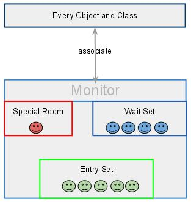

* content
  {:toc}

总结java线程基础知识

* wait、notify、notifyAll

## 一. 示例

### 1. 方法介绍

> void notify()
> Wakes up a single thread that is waiting on this object’s monitor.
> 译：唤醒在此对象监视器上等待的单个线程
>
> void notifyAll()
> Wakes up all threads that are waiting on this object’s monitor.
> 译：唤醒在此对象监视器上等待的所有线程
>
> void wait( )
> Causes the current thread to wait until another thread invokes the notify() method or the notifyAll( ) method for this object.
> 译：导致当前的线程等待，直到其他线程调用此对象的notify( ) 方法或 notifyAll( ) 方法
>
> void wait(long timeout)
> Causes the current thread to wait until either another thread invokes the notify( ) method or the notifyAll( ) method for this object, or a specified amount of time has > elapsed.
> 译：导致当前的线程等待，直到其他线程调用此对象的notify() 方法或 notifyAll() 方法，或者指定的时间过完。
>
> void wait(long timeout, int nanos)
> Causes the current thread to wait until another thread invokes the notify( ) method or the notifyAll( ) method for this object, or some other thread interrupts the current > thread, or a certain amount of real time has elapsed.
> 译：导致当前的线程等待，直到其他线程调用此对象的notify( ) 方法或 notifyAll( ) 方法，或者其他线程打断了当前线程，或者指定的时间过完。

### 2. 简单示例

```java
public class WaitAndNotify {
    public static void main(String[] args) {
        Object co = new Object();
        System.out.println(co);

        for (int i = 0; i < 5; i++) {
            MyThread t = new MyThread("Thread" + i, co);
            t.start();
        }

        try {
            TimeUnit.SECONDS.sleep(2);
            System.out.println("-----Main Thread notify-----");
            synchronized (co) {
                co.notify();
            }

            TimeUnit.SECONDS.sleep(2);
            System.out.println("Main Thread is end.");

        } catch (InterruptedException e) {
            e.printStackTrace();
        }
    }

    static class MyThread extends Thread {
        private String name;
        private Object co;

        public MyThread(String name, Object o) {
            this.name = name;
            this.co = o;
        }

        @Override
        public void run() {
            System.out.println(name + " is waiting.");
            try {
                synchronized (co) {
                    co.wait();
                }
                System.out.println(name + " has been notified.");
            } catch (InterruptedException e) {
                e.printStackTrace();
            }
        }
    }
}
```

```
运行结果：
java.lang.Object@1540e19d
Thread1 is waiting.
Thread2 is waiting.
Thread0 is waiting.
Thread3 is waiting.
Thread4 is waiting.
-----Main Thread notify-----
Thread1 has been notified.
Main Thread is end.

将其中的那个notify换成notifyAll，运行结果：
Thread0 is waiting.
Thread1 is waiting.
Thread2 is waiting.
Thread3 is waiting.
Thread4 is waiting.
-----Main Thread notifyAll-----
Thread4 has been notified.
Thread2 has been notified.
Thread1 has been notified.
Thread3 has been notified.
Thread0 has been notified.
Main Thread is end.

运行环境jdk8，结论：
notify唤醒一个等待的线程；notifyAll唤醒所有等待的线程。
```

### 3. 生产者-消费者问题

#### 什么是生产者-消费者问题?


> 假设有一个公共的容量有限的池子，有两种人，一种是生产者，另一种是消费者。需要满足如下条件：
> 1、生产者产生资源往池子里添加，前提是池子没有满，如果池子满了，则生产者暂停生产，直到自己的生成能放下池子。
> 2、消费者消耗池子里的资源，前提是池子的资源不为空，否则消费者暂停消耗，进入等待直到池子里有资源数满足自己的需求。

```java
public interface AbstractStorage {
    void consume(int num);
    void produce(int num);
}
```

```java
import java.util.LinkedList;

/**
 *  生产者和消费者的问题
 *  wait、notify/notifyAll() 实现
 */
public class Storage1 implements AbstractStorage {
    //仓库最大容量
    private final int MAX_SIZE = 100;
    //仓库存储的载体
    private LinkedList list = new LinkedList();

    //生产产品
    public void produce(int num){
        //同步
        synchronized (list){
            //仓库剩余的容量不足以存放即将要生产的数量，暂停生产
            while(list.size()+num > MAX_SIZE){
                System.out.println("【要生产的产品数量】:" + num + "\t【库存量】:"
                        + list.size() + "\t暂时不能执行生产任务!");

                try {
                    //条件不满足，生产阻塞
                    list.wait();
                } catch (InterruptedException e) {
                    e.printStackTrace();
                }
            }

            for(int i=0;i<num;i++){
                list.add(new Object());
            }

            System.out.println("【已经生产产品数】:" + num + "\t【现仓储量为】:" + list.size());

            list.notifyAll();
        }
    }

    //消费产品
    public void consume(int num){
        synchronized (list){

            //不满足消费条件
            while(num > list.size()){
                System.out.println("【要消费的产品数量】:" + num + "\t【库存量】:"
                        + list.size() + "\t暂时不能执行消费任务!");

                try {
                    list.wait();
                } catch (InterruptedException e) {
                    e.printStackTrace();
                }
            }

            //消费条件满足，开始消费
            for(int i=0;i<num;i++){
                list.remove();
            }

            System.out.println("【已经消费产品数】:" + num + "\t【现仓储量为】:" + list.size());

            list.notifyAll();
        }
    }
}
```

```java
public class Producer extends Thread{
    //每次生产的数量
    private int num ;

    //所属的仓库
    public AbstractStorage abstractStorage;

    public Producer(AbstractStorage abstractStorage){
        this.abstractStorage = abstractStorage;
    }

    public void setNum(int num){
        this.num = num;
    }

    // 线程run函数
    @Override
    public void run()
    {
        produce(num);
    }

    // 调用仓库Storage的生产函数
    public void produce(int num)
    {
        abstractStorage.produce(num);
    }
}
```

```java
public class Consumer extends Thread{
    // 每次消费的产品数量
    private int num;

    // 所在放置的仓库
    private AbstractStorage abstractStorage1;

    // 构造函数，设置仓库
    public Consumer(AbstractStorage abstractStorage1)
    {
        this.abstractStorage1 = abstractStorage1;
    }

    // 线程run函数
    public void run()
    {
        consume(num);
    }

    // 调用仓库Storage的生产函数
    public void consume(int num)
    {
        abstractStorage1.consume(num);
    }

    public void setNum(int num){
        this.num = num;
    }
}
```

```java
public class Test{
    public static void main(String[] args) {
        // 仓库对象
        AbstractStorage abstractStorage = new Storage1();

        // 生产者对象
        Producer p1 = new Producer(abstractStorage);
        Producer p2 = new Producer(abstractStorage);
        Producer p3 = new Producer(abstractStorage);
        Producer p4 = new Producer(abstractStorage);
        Producer p5 = new Producer(abstractStorage);
        Producer p6 = new Producer(abstractStorage);
        Producer p7 = new Producer(abstractStorage);

        // 消费者对象
        Consumer c1 = new Consumer(abstractStorage);
        Consumer c2 = new Consumer(abstractStorage);
        Consumer c3 = new Consumer(abstractStorage);

        // 设置生产者产品生产数量
        p1.setNum(10);
        p2.setNum(10);
        p3.setNum(10);
        p4.setNum(10);
        p5.setNum(10);
        p6.setNum(10);
        p7.setNum(80);

        // 设置消费者产品消费数量
        c1.setNum(50);
        c2.setNum(20);
        c3.setNum(30);

        // 线程开始执行
        c1.start();
        c2.start();
        c3.start();

        p1.start();
        p2.start();
        p3.start();
        p4.start();
        p5.start();
        p6.start();
        p7.start();
    }
}
```

更简洁的生产者-消费者代码

```java
import java.util.LinkedList;
import java.util.Queue;
import java.util.Random;

/**
* Simple Java program to demonstrate How to use wait, notify and notifyAll()
* method in Java by solving producer consumer problem.
*
* @author Javin Paul
*/
public class ProducerConsumerInJava {
    public static void main(String args[]) {
        System.out.println("How to use wait and notify method in Java");
        System.out.println("Solving Producer Consumper Problem");
        Queue<Integer> buffer = new LinkedList<>();
        int maxSize = 10;
        Thread producer = new Producer(buffer, maxSize, "PRODUCER");
        Thread consumer = new Consumer(buffer, maxSize, "CONSUMER");
        producer.start(); 
        consumer.start(); 
    }
}

/**
* Producer Thread will keep producing values for Consumer
* to consumer. It will use wait() method when Queue is full
* and use notify() method to send notification to Consumer
* Thread.
*
* @author WINDOWS 8
*
*/
class Producer extends Thread
{ 
    private Queue<Integer> queue;
    private int maxSize;
    public Producer(Queue<Integer> queue, int maxSize, String name){
        super(name); 
        this.queue = queue; 
        this.maxSize = maxSize;
    }

    @Override 
    public void run()
    {
        while (true){
            synchronized (queue) {
                while (queue.size() == maxSize) {
                    try {
                        System.out .println("Queue is full, " + "Producer thread waiting for " + "consumer to take something from queue");
                        queue.wait();
                    } catch (Exception ex) {
                        ex.printStackTrace(); 
                    }
                }
                Random random = new Random();
                int i = random.nextInt();
                System.out.println("Producing value : " + i); 
                queue.add(i); 
                queue.notifyAll();
            }
        }
    }
}

/**
* Consumer Thread will consumer values form shared queue.
* It will also use wait() method to wait if queue is
* empty. It will also use notify method to send
* notification to producer thread after consuming values
* from queue.
*
* @author WINDOWS 8
*
*/
class Consumer extends Thread {
    private Queue<Integer> queue;
    private int maxSize;
    public Consumer(Queue<Integer> queue, int maxSize, String name){
        super(name);
        this.queue = queue;
        this.maxSize = maxSize;
    }
    @Override public void run() {
        while (true) {
            synchronized (queue) {
                while (queue.isEmpty()) {
                    System.out.println("Queue is empty," + "Consumer thread is waiting" + " for producer thread to put something in queue");
                    try {
                        queue.wait();
                    } catch (Exception ex) {
                        ex.printStackTrace();
                    }
                }
                System.out.println("Consuming value : " + queue.remove()); queue.notifyAll();
            }
        }
    }
}
```

## 问题

### 1. 为什么wait、notify必须在持有锁的情况下才能执行？

a. 如果在未持有对象锁的情况下调用object.wait()/notify()，直接会报错，JDK已经做好保护。

b. 判断条件与wait()方法分为两个步骤，在不加锁的情况下，假设thread1在执行到两个步骤中间的时候thread2执行了条件设置和nofity()方法，那thread1的wait就错过了notify通知。

通过互斥锁来保证wait()/notify()之间的先后顺序，才能保证wait不会错过notify，从而导致wait线程一直挂着。


### 2. 为什么在Object中提供wait、nodify方法?为什么不是在Thread中提供？

a. wait()方法告诉当前线程释放监视器(monitor)并将线程放入等待队列，直到其它线程进入相同的监视器(monitor)并调用nodify()

b. notify()唤醒在这个对象的监视器(monitor)上等待的单个线程

c. 这两个方法是线程之间通信的方式，都是monitor级别的方法，monitor是关联到Object的而不是Thread的(所有对象都有监视器monitor)

d. 如果仅仅在Thread中提供这两种方法，那一个线程必须知道其它线程的状态，其它线程在等待哪些资源，这样才能(调用thread2.nofity())通知它们去获取这些资源，然而在java里面线程之间是无法互相知道对方状态的




## 参考

[wait和notify的理解与使用](https://blog.csdn.net/jianiuqi/article/details/53448849)

[java中的notify和notifyAll有什么区别？](https://www.zhihu.com/question/37601861/answer/94679949)

[Java多线程学习之wait、notify/notifyAll 详解](http://www.cnblogs.com/moongeek/p/7631447.html)

[java中的notify和notifyAll有什么区别？](https://blog.csdn.net/djzhao/article/details/79410229)

[为什么wait,notify和notifyAll要与synchronized一起使用？](https://blog.csdn.net/qq_39907763/article/details/79301813)

[Why must wait() always be in synchronized block](https://stackoverflow.com/questions/2779484/why-must-wait-always-be-in-synchronized-block)

[How can the wait() and notify() methods be called on Objects that are not threads?](https://stackoverflow.com/questions/16197135/how-can-the-wait-and-notify-methods-be-called-on-objects-that-are-not-thread)
