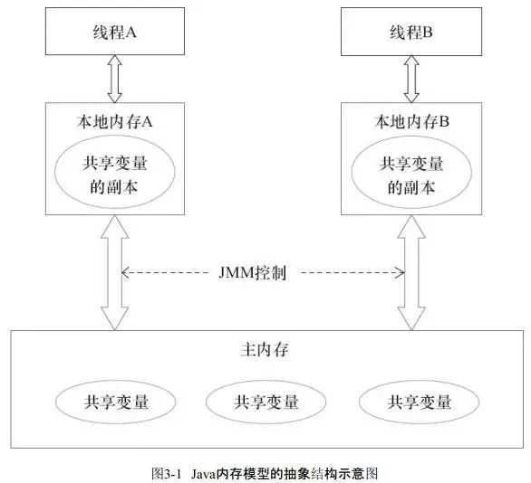

* content
  {:toc}

总结java线程基础知识

* JMM

## 一. 基本概念

### 1. 计算机内存模型

> 在多核多CPU的环境下并发执行指令的时候，由于每个CPU核心都有自己的高速缓存，CPU缓存之间是相互隔离的，但是各个缓存中数据可能对应主内存中相同的数据，在CPU进行数据读取、写入的过程中就会存在缓存一致性的问题。解决缓存一致性的问题有两种方式：
>
> * 在总线上加锁，同一时间只能有一个CPU核心操作主内存的同一份数据内存
> * 缓存一致性协议，当CPU写数据时，如果发现操作的变量是共享变量，即在其他CPU中也存在该变量的副本，会发出信号通知其他CPU将该变量的缓存行置为无效状态，因此当其他CPU需要读取这个变量时，发现自己缓存中缓存该变量的缓存行是无效的，那么它就会从内存重新读取。
>
>> **缓存一致性协议(MESI)：**
>>
>> 下面分析两核cpu的读写操作
>> 假如cpuA要读取一个数据x的流程
>> 1.cpuA先在自己的缓存里找x,看是否缓存过,如果是则查看状态,如果不是Invalid状态,则直接读取
>> 2.若状态为无效,则cpuA向总线发送一个请求,表示需要读取x,由于cpu之间是互相监听的状态,其他cpu获取到这个请求,到自己的缓存中找x,如果找到这个数据且不为Invalid状态,向总线发送一个消息通知cpuA去获取,如果是Exclusive(独占)状态,首先要将它变为Shared(共享态),如果该数据为Modifield(被修改)状态,则要把该数据写到内存中去,把状态改为Shared,再通知cpuA,如果其他cpu的状态都为Invalid态,则向主内存中读取
>> cpuA要写入一个数据的流程
>> 1.首先查看自己的缓存中是否有这个数据,若存在且为Exclusive或Modified状态,则直接写入
>> 2.如果时Shared态,则通过总线向其他cpu发送消息,其他cpu接受到消息把自己的数据置为无效
>> 3,如果为Invalid态,则先向主内存中读取,然后写入,再把其他cpu内的数据置为Invalid
>> 总结:cpu除了和内存传输时需要进行总线交互,还会不断地监听和嗅探总线上发生的数据交换,当一个缓存代表它所在的处理器去读写内存时,其他处理器都会得到通知来使自己的缓存保持同步
>>

### 2. 什么是JMM

> Java内存模型（Java Memory Model ,JMM）就是一种符合内存模型规范的，屏蔽了各种硬件和操作系统的访问差异的，保证了Java程序在各种平台下对内存的访问都能保证效果一致的机制及规范。JMM决定一个线程对共享变量的写入何时对另一个线程可见。
>
> Java内存模型规定了所有的变量都存储在主内存中，每条线程还有自己的工作内存，线程的工作内存中保存了该线程中是用到的变量的主内存副本拷贝，线程对变量的所有操作都必须在工作内存中进行，而不能直接读写主内存。不同的线程之间也无法直接访问对方工作内存中的变量，线程间变量的传递均需要自己的工作内存和主存之间进行数据同步进行。
>
> 而JMM就作用于工作内存和主存之间数据同步过程。他规定了如何做数据同步以及什么时候做数据同步。
>
> 总结下，JMM是一种规范，目的是解决由于多线程通过共享内存进行通信时，存在的本地内存数据不一致、编译器会对代码指令重排序、处理器会对代码乱序执行等带来的问题。

### 3. JMM解决并发编程的三个问题

#### 原子性

#### 可见性

#### 有序性

### 4. JMM的实现

Java内存模型，除了定义了一套规范，还提供了一系列原语，封装了底层实现后，供开发者直接使用。
比如volatile、synchronized、final、concurrent包等

### 5. JMM下的线程间通信

JMM规定线程间通信必须要经过主内存。如果线程A与线程B之间要通信的话，必须要经历下面2个步骤：

1. 线程A把本地内存A中更新过的共享变量刷新到主内存中去。
2. 线程B到主内存中去读取线程A之前已更新过的共享变量。

关于主内存与工作内存之间的具体交互协议，即一个变量如何从主内存拷贝到工作内存、如何从工作内存同步到主内存之间的实现细节，Java内存模型定义了以下八种操作来完成：

* lock（锁定）：作用于主内存的变量，把一个变量标识为一条线程独占状态。
* read（读取）：作用于主内存变量，把一个变量值从主内存传输到线程的工作内存中，以便随后的load动作使用
* load（载入）：作用于工作内存的变量，它把read操作从主内存中得到的变量值放入工作内存的变量副本中。
* use（使用）：作用于工作内存的变量，把工作内存中的一个变量值传递给执行引擎，每当虚拟机遇到一个需要使用变量的值的字节码指令时将会执行这个操作。
* assign（赋值）：作用于工作内存的变量，它把一个从执行引擎接收到的值赋值给工作内存的变量，每当虚拟机遇到一个给变量赋值的字节码指令时执行这个操作。
* store（存储）：作用于工作内存的变量，把工作内存中的一个变量的值传送到主内存中，以便随后的write的操作。
* write（写入）：作用于主内存的变量，它把store操作从工作内存中一个变量的值传送到主内存的变量中。
* unlock（解锁）：作用于主内存变量，把一个处于锁定状态的变量释放出来，释放后的变量才可以被其他线程锁定。

## 参考

[来，了解一下Java内存模型(JMM)](https://segmentfault.com/a/1190000016085105)

[Java内存模型（JMM）总结](https://zhuanlan.zhihu.com/p/29881777)

[The Java® Virtual Machine Specification-Java虚拟机规范](https://docs.oracle.com/javase/specs/jvms/se8/html/index.html)

[CPU缓存一致性协议MESI](https://www.cnblogs.com/yanlong300/p/8986041.html)

[MESI--CPU缓存一致性协议](https://www.cnblogs.com/z00377750/p/9180644.html)

[Java内存模型是什么](https://mp.weixin.qq.com/s?__biz=MzI3NzE0NjcwMg==&mid=2650121599&idx=1&sn=42b2cfabfb3057ac6c09026a8b9656cd&chksm=f36bb85ec41c31489e461a53e78f2959f0224c87c312724f420265b70e67e4efdae2331155aa&scene=21#wechat_redirect)

[内存模型是怎么解决缓存一致性的？](https://mp.weixin.qq.com/s?__biz=MzI3NzE0NjcwMg==&mid=2650121900&idx=1&sn=3fb8ecdbe67eaa44b27e859a83676c64&chksm=f36bbb8dc41c329b8213623ed7832d4a337b11db8c20a5589d4f53f3f171e875fbc1d6e09229&mpshare=1&scene=23&srcid=0820SnQ8AC7dLy9o54aBqRMr#rd)
