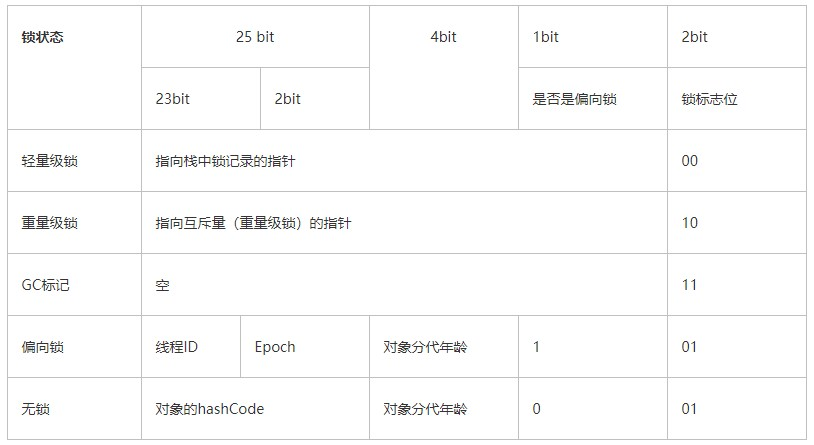
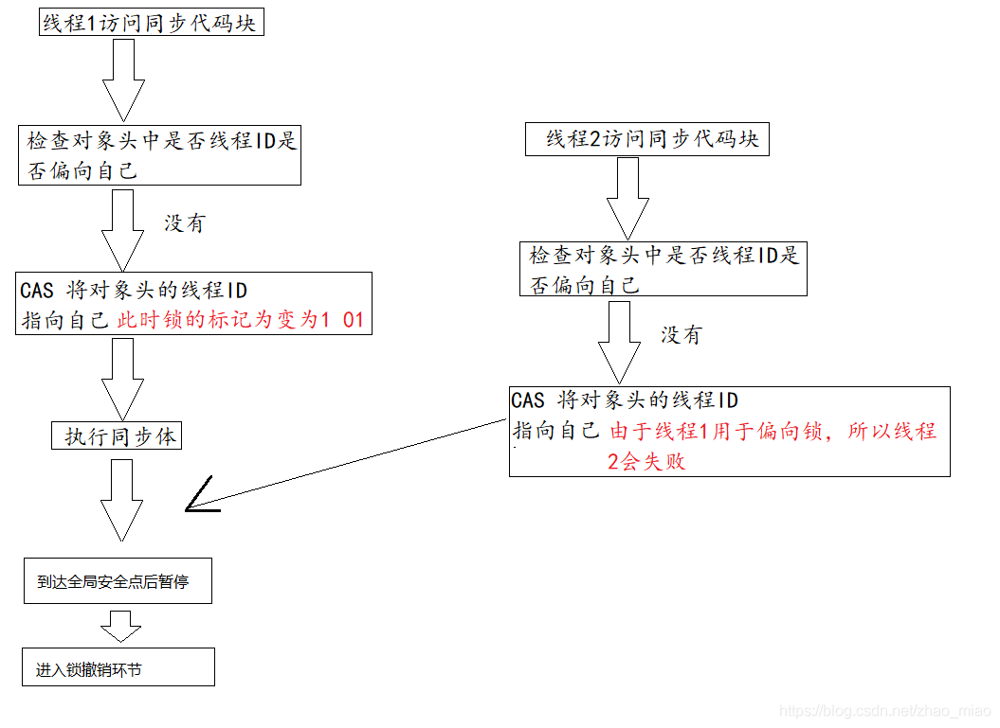
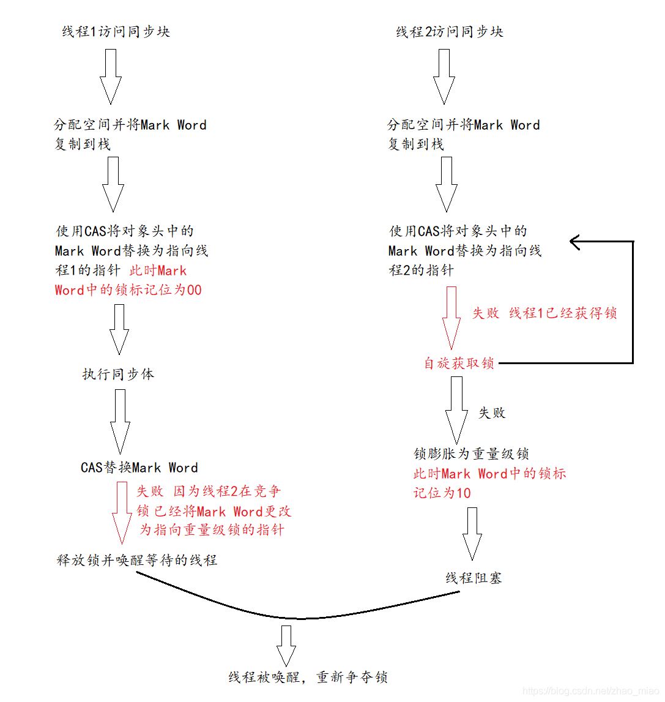

* content
  {:toc}

总结java线程基础知识

* synchronized

## 介绍

synchronized，是Java中用于解决并发情况下数据同步访问的一个很重要的关键字。当我们想要保证一个共享资源在同一时间只会被一个线程访问到时，我们可以在代码中使用synchronized关键字对类或者对象加锁。那么，本文来介绍一下synchronized关键字的实现原理是什么。在阅读本文之间，建议先看下Java虚拟机是如何执行线程同步的 。

## 反编译

众所周知，在Java中，synchronized有两种使用形式，同步方法和同步代码块。代码如下：

```java
/**
 * @author Hollis 17/11/9.
 */
public class SynchronizedTest {

    public synchronized void doSth(){
        System.out.println("Hello World");
    }

    public void doSth1(){
        synchronized (SynchronizedTest.class){
            System.out.println("Hello World");
        }
    }
}
```

我们先来使用Javap来反编译以上代码，结果如下（部分无用信息过滤掉了）：

```
public synchronized void doSth();
    descriptor: ()V
    flags: ACC_PUBLIC, ACC_SYNCHRONIZED
    Code:
      stack=2, locals=1, args_size=1
         0: getstatic     #2                  // Field java/lang/System.out:Ljava/io/PrintStream;
         3: ldc           #3                  // String Hello World
         5: invokevirtual #4                  // Method java/io/PrintStream.println:(Ljava/lang/String;)V
         8: return

  public void doSth1();
    descriptor: ()V
    flags: ACC_PUBLIC
    Code:
      stack=2, locals=3, args_size=1
         0: ldc           #5                  // class com/hollis/SynchronizedTest
         2: dup
         3: astore_1
         4: monitorenter
         5: getstatic     #2                  // Field java/lang/System.out:Ljava/io/PrintStream;
         8: ldc           #3                  // String Hello World
        10: invokevirtual #4                  // Method java/io/PrintStream.println:(Ljava/lang/String;)V
        13: aload_1
        14: monitorexit
        15: goto          23
        18: astore_2
        19: aload_1
        20: monitorexit
        21: aload_2
        22: athrow
        23: return
```

[反编译](http://www.hollischuang.com/archives/58)后，我们可以看到Java编译器为我们生成的字节码。在对于doSth和doSth1的处理上稍有不同。也就是说。JVM对于同步方法和同步代码块的处理方式不同。

对于同步方法，JVM采用ACC_SYNCHRONIZED标记符来实现同步。 对于同步代码块。JVM采用monitorenter、monitorexit两个指令来实现同步。

关于这部分内容，在[JVM规范](https://docs.oracle.com/javase/specs/jvms/se8/html/jvms-3.html#jvms-3.14)中也可以找到相关的描述。

## 同步方法

[The Java® Virtual Machine Specification](https://docs.oracle.com/javase/specs/jvms/se8/html/jvms-2.html#jvms-2.11.10)中有关于方法级同步的介绍：

> Method-level synchronization is performed implicitly, as part of method invocation and return. A synchronized method is distinguished in the run-time constant pool’s method_info structure by the ACC_SYNCHRONIZED flag, which is checked by the method invocation instructions. When invoking a method for which ACC_SYNCHRONIZED is set, the executing thread enters a monitor, invokes the method itself, and exits the monitor whether the method invocation completes normally or abruptly. During the time the executing thread owns the monitor, no other thread may enter it. If an exception is thrown during invocation of the synchronized method and the synchronized method does not handle the exception, the monitor for the method is automatically exited before the exception is rethrown out of the synchronized method.

主要说的是： 方法级的同步是隐式的。同步方法的常量池中会有一个`ACC_SYNCHRONIZED`标志。当某个线程要访问某个方法的时候，会检查是否有`ACC_SYNCHRONIZED`，如果有设置，则需要先获得监视器锁，然后开始执行方法，方法执行之后再释放监视器锁。这时如果其他线程来请求执行方法，会因为无法获得监视器锁而被阻断住。值得注意的是，如果在方法执行过程中，发生了异常，并且方法内部并没有处理该异常，那么在异常被抛到方法外面之前监视器锁会被自动释放。

## 同步代码块

同步代码块使用`monitorenter`和`monitorexit`两个指令实现。 [The Java® Virtual Machine Specification](https://docs.oracle.com/javase/specs/jvms/se8/html/jvms-6.html) 中有关于这两个指令的介绍：

monitorenter

> Each object is associated with a monitor. A monitor is locked if and only if it has an owner. The thread that executes monitorenter attempts to gain ownership of the monitor associated with objectref, as follows:
>
>> If the entry count of the monitor associated with objectref is zero, the thread enters the monitor and sets its entry count to one. The thread is then the owner of the monitor.
>>
>> If the thread already owns the monitor associated with objectref, it reenters the monitor, incrementing its entry count.
>>
>> If another thread already owns the monitor associated with objectref, the thread blocks until the monitor’s entry count is zero, then tries again to gain ownership.
>>

monitorexit

> The thread that executes monitorexit must be the owner of the monitor associated with the instance referenced by objectref.
>
> The thread decrements the entry count of the monitor associated with objectref. If as a result the value of the entry count is zero, the thread exits the monitor and is no longer its owner. Other threads that are blocking to enter the monitor are allowed to attempt to do so.

大致内容如下： 可以把执行`monitorenter`指令理解为加锁，执行`monitorexit`理解为释放锁。 每个对象维护着一个记录着被锁次数的计数器。未被锁定的对象的该计数器为0，当一个线程获得锁（执行`monitorenter`）后，该计数器自增变为 1 ，当同一个线程再次获得该对象的锁的时候，计数器再次自增。当同一个线程释放锁（执行`monitorexit`指令）的时候，计数器再自减。当计数器为0的时候。锁将被释放，其他线程便可以获得锁。

## 总结

同步方法通过`ACC_SYNCHRONIZED`关键字隐式的对方法进行加锁。当线程要执行的方法被标注上`ACC_SYNCHRONIZED`时，需要先获得锁才能执行该方法。

同步代码块通过`monitorenter`和`monitorexit`执行来进行加锁。当线程执行到`monitorenter`的时候要先获得所锁，才能执行后面的方法。当线程执行到`monitorexit`的时候则要释放锁。

每个对象自身维护这一个被加锁次数的计数器，当计数器数字为0时表示可以被任意线程获得锁。当计数器不为0时，只有获得锁的线程才能再次获得锁。即可重入锁。

两个指令的执行是JVM通过调用操作系统的互斥原语mutex来实现，被阻塞的线程会被挂起、等待重新调度，会导致“用户态和内核态”两个态之间来回切换，对性能有较大影响。

## 原理

[深入分析Synchronized原理](https://www.jianshu.com/p/e62fa839aa41)



### 偏向锁

锁偏向是一种针对加锁操作的优化手段。它的核心思想是：如果一个线程获得了锁，那么锁就进入偏向模式。当这个线程再次请求锁时，无须再做任何同步操作。这样就节省了大量有关锁申请的操作，从而提高了程序性能。因此，对于几乎没有锁竞争的场合，偏向锁有比较好的优化效果，因为连续多次极有可能是同一个线程请求相同的锁。而对于锁竞争比较激烈的场合，其效果不佳。因为在竞争激烈的场合，最有可能的情况是每次都是不同的线程来请求相同的锁。这样偏向模式会失效，因此还不如不启用偏向锁。

#### 偏向锁的获取过程

1. 访问Mark Word中偏向锁的标识为1，锁标志位为01，确认为可偏向状态。
2. 如果为可偏向状态，则测试线程ID是否指向当前线程，如果是，进入步骤5，否则进入步骤3。
3. 如果线程ID并未指向当前线程，则通过CAS操作竞争锁。如果竞争成功，则将Mark Word中线程ID设置为当前线程ID，然后执行5；如果竞争失败，执行4。
4. 如果CAS获取偏向锁失败，则表示有竞争。当到达全局安全点（safepoint）时获得偏向锁的线程被挂起，偏向锁升级为轻量级锁，然后被阻塞在安全点的线程继续往下执行同步代码。（撤销偏向锁的时候会导致stop the word）
5. 执行同步代码。



#### 偏向锁的撤销过程

偏向锁的撤销在上述第四步骤中有提到，偏向锁只有遇到其他线程尝试竞争偏向锁时，持有偏向锁的线程才会释放锁，线程不会主动去释放偏向锁。偏向锁的撤销，需要等待全局安全点（在这个时间点上没有字节码正在执行），它会首先暂停拥有偏向锁的线程，判断锁对象是否处于被锁定状态，撤销偏向锁后恢复到未锁定（标志位为“01”）或轻量级锁（标志位为“00”）的状态。

### 轻量级锁

#### 轻量级锁的加锁过程

（1）在代码进入同步块的时候，如果同步对象锁状态为无锁状态（锁标志位为“01”状态，是否为偏向锁为“0”），虚拟机首先将在当前线程的栈帧中建立一个名为锁记录（Lock Record）的空间，用于存储锁对象目前的Mark Word的拷贝，官方称之为 Displaced Mark Word。这时候线程堆栈与对象头的状态如图所示。


（2）拷贝对象头中的Mark Word复制到锁记录中。

（3）拷贝成功后，虚拟机将使用CAS操作尝试将对象的Mark Word更新为指向Lock Record的指针，并将Lock record里的owner指针指向object mark word。如果更新成功，则执行步骤（4），否则执行步骤（5）。

（4）如果这个更新动作成功了，那么这个线程就拥有了该对象的锁，并且对象Mark Word的锁标志位设置为“00”，即表示此对象处于轻量级锁定状态，这时候线程堆栈与对象头的状态如图所示。


（5）如果这个更新操作失败了，虚拟机首先会检查对象的Mark Word是否指向当前线程的栈帧，如果是就说明当前线程已经拥有了这个对象的锁，那就可以直接进入同步块继续执行。否则说明多个线程竞争锁，轻量级锁就要膨胀为重量级锁，锁标志的状态值变为“10”，Mark Word中存储的就是指向重量级锁（互斥量）的指针，后面等待锁的线程也要进入阻塞状态。 而当前线程便尝试使用自旋来获取锁，自旋就是为了不让线程阻塞，而采用循环去获取锁的过程。



#### 轻量级锁的解锁过程

（1）通过CAS操作尝试把线程中复制的Displaced Mark Word对象替换当前的Mark Word。

（2）如果替换成功，整个同步过程就完成了。

（3）如果替换失败，说明有其他线程尝试过获取该锁（此时锁已膨胀），那就要在释放锁的同时，唤醒被挂起的线程。

### 重量级锁

### 锁升级过程

* 一个锁对象刚刚开始创建的时候，没有任何线程来访问它，它是可偏向的，它现在认为只可能有一个线程来访问它，所以当第一个线程来访问他的时候，它会偏向这个线程。此时对象状态为无锁状态，锁标志位为 01
* 当一个线程（线程 A）来获取锁的时，会首先检查所标志位，此时锁标志位为 01，然后检查是否为偏向锁，此时不为偏向锁0，所以当前线程会修改对象头状态为偏向锁，同时将对象头中的 ThreadID 改成自己的 Thread ID
* 如果再有一个线程（线程 B）过来，此时锁状态为偏向锁，该线程会检查 Mark Word 中记录的线程 ID 是否为自己的线程 ID，如果是，执行同步代码块。如果不是，则利用 CAS 尝试替换 Mark Word 中的 Thread ID，成功，表示该线程（线程 B）获取偏向锁，执行同步代码块
  如果失败，则表明当前环境存在锁竞争情况，则执行偏向锁的撤销工作（这里有一点需要注意的是：偏向锁的释放并不是主动，而是被动的，什么意思呢？就是说持有偏向锁的线程执行完同步代码后不会主动释放偏向锁，而是等待其他线程来竞争才会释放锁）。撤销偏向锁的操作需要等到全局安全点才会执行，然后暂停持有偏向锁的线程，同时检查该线程的状态，如果该线程不处于活动状态或者已经退出同步代码块，则设置为无锁状态（线程 ID 为空，是否为偏向锁为 0 ，锁标志位为01）重新偏向，同时恢复该线程。若该线程活着，则会遍历该线程栈帧中的锁记录，检查锁记录的使用情况，如果仍然需要持有偏向锁，则撤销偏向锁，升级为轻量级锁。
* 在升级为轻量级锁之前，持有偏向锁的线程（线程 A）是暂停的，JVM 首先会在原持有偏向锁的线程（线程 A）的栈中创建一个名为锁记录的空间（Lock Record），用于存放锁对象目前的 Mark Word 的拷贝，然后拷贝对象头中的 Mark Word 到原持有偏向锁的线程（线程 A）的锁记录中（官方称之为 Displaced Mark Word ），这时线程 A 获取轻量级锁，此时 Mark Word 的锁标志位为 00，指向锁记录的指针指向线程 A 的锁记录地址
* 当原持有偏向锁的线程（线程 A）获取轻量级锁后，JVM 唤醒线程 A，线程 A 执行同步代码块，执行完成后，开始轻量级锁的释放过程。
* 对于其他线程而言，也会在栈帧中建立锁记录，存储锁对象目前的 Mark Word 的拷贝。JVM 利用 CAS 操作尝试将锁对象的 Mark Word 更正指向当前线程的 Lock Record，如果成功，表明竞争到锁，则执行同步代码块，如果失败，那么线程尝试使用自旋的方式来等待持有轻量级锁的线程释放锁。当然，它不会一直自旋下去，因为自旋的过程也会消耗 CPU，而是**自旋一定的次数**，如果自旋了一定次数后还是失败，则升级为重量级锁，阻塞所有未获取锁的线程，等待释放锁后唤醒。
* 轻量级锁的释放，会使用 CAS 操作将 Displaced Mark Word 替换会对象头中，成功，则表示没有发生竞争，直接释放。如果失败，表明锁对象存在竞争关系，这时会轻量级锁会升级为重量级锁，然后释放锁，唤醒被挂起的线程，开始新一轮锁竞争，注意这个时候的锁是重量级锁。


## Synchronized与Lock的区别

1. synchronized是java内置关键字，在jvm层面，Lock是java类；
2. synchronized无法判断是否获取锁的状态，Lock可以判断是否获取到；
3. synchronized会自动释放锁(a 线程执行完同步代码会释放锁 ；b 线程执行过程中发生异常会释放锁)，Lock需在finally中手工释放锁（unlock()方法释放锁），否则容易造成线程死锁；
4. 用synchronized关键字的两个线程1和线程2，如果当前线程1获得锁，线程2线程等待。如果线程1阻塞，线程2则会一直等待下去，而Lock锁就不一定会等待下去，如果尝试获取不到锁，线程可以不用一直等待就结束了；
5. synchronized的锁可重入、不可中断、非公平，而Lock锁可重入、可判断、可公平
6. Lock锁适合大量同步的代码的同步问题，synchronized锁适合代码少量的同步问题。
7. Lock是一个接口，synchronized是一个关键字，synchronized放弃锁只有两种情况：①线程执行完了同步代码块的内容②发生异常；而lock不同，它可以设定超时时间，也就是说他可以在获取锁时便设定超时时间，如果在你设定的时间内它还没有获取到锁，那么它会放弃获取锁然后响应放弃操作。

## 参考

[Java并发编程：Synchronized底层优化（偏向锁、轻量级锁）](https://www.cnblogs.com/paddix/p/5405678.html)

[深入理解多线程（一）——Synchronized的实现原理](http://www.hollischuang.com/archives/1883)

[**Java中的偏向锁，轻量级锁， 重量级锁解析](https://blog.csdn.net/lengxiao1993/article/details/81568130)
