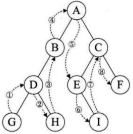

* content
  
  {:toc}

## 二叉树

### 概念

* 深度：从根节点到该节点的最长简单路径边的条数，根节点为1，从上往下数

  > * 深度为n，最多有2ⁿ-1个结点【n≥1】
  > * 第i层，最多有2的（i-1）次方个结点
  > * 具有n个结点的完全二叉树的深度为 [log2n]+1，[ ]代表向下取整
  > * 查找复杂度O(log2n)，比数组O(n)要好，一条腿的二叉树就退化为数组了，二叉查找树的查找时间复杂度O(log2n)就是树的深度/高度，简写成logn
  >
* 高度(h)：从该节点到叶子节点的最长简单路径边的条数，从下往上数

  > 一棵树的深度和高度是一样的，但是针对树中间的某个节点来说，深度和高度就不一定一样
  >
* 度，也叫阶(n)：孩子的个数，孩子个数的最大值就是这棵树的度

  > * n0=n2+1，一棵二叉树度为0的节点个数=度为2的节点个数加1
  > * 结点总数=度数*该度数对应的结点数+1，例如
  >
* 层：根节点层数=1，往下依次递增
* 满二叉树
* 完全二叉树

> 常见查找算法：
>
> * 遍历O(n)
> * 二分查找O(log2n)，元素必须是有序的，就是二叉树，或者叫二叉查找树
> * 哈希查找O(1)，最高效
> * [索引查找](https://www.cnblogs.com/nnngu/p/8290367.html)
> * AVL树（）
> * B+树
> * B树
> * 红黑树

#### 二叉树的特点

* 左子树上所有节点的值均小于或等于它的根结点的值。
* 右子树上所有节点的值均大于或等于它的根结点的值。

#### 二叉树的查找过程

先与根节点比较，比根节点大则从右子树查找，比根节点小则从左子树查找，然后重复上面的过程，一直到找到我们需要的元素为止。

#### 二叉树的新增/删除过程

插入的时候比较简单，从根节点查找插入位置（叶子节点）插入即可。

删除的时候分几种情况：

* 待删除节点只有左子树，直接修改左子树的指针指向父节点即可
* 待删除节点只有右子树，直接修改右子树的指针指向父节点即可
* 待删除节点既有左子树又有右子树，则找出左子树的最大值，或者右子树的最小值，直接替换待删除节点即可，这两个节点正好是待删除节点的前驱和后继

[二叉查找树新增/删除过程](https://blog.csdn.net/u014634338/article/details/39102739)

### 平衡二叉树(AVL树)

一棵AVL树要么是空树，要么是具有下列性质的二叉查找树：它的左子树和右子树都是AVL树，且左子树和右子树的高度之差的绝对值不超过1。

* 平衡因子(Balance Factor,BF)：定义为当前结点的左子树高度减去右子树的高度之差，根节点BF=0则代表是平衡的
* 最小不平衡子树：距离插入结点最近的，且平衡因子的绝对值大于1的结点为根的子树，（不平衡即失衡，指BF超出合法值）
* 最小非平衡子树：包含插入结点位置，其根结点的BF是1或-1的最小子树，（非平衡指BF非0，但BF在合法值范围内）

#### AVL树的插入/删除过程

平衡二叉树的查找过程与一般二叉树一样，但是插入或者删除过程不同，为了保持高度平衡，需要进行树的旋转

**插入时的旋转分为4种情况（基于最小不平衡子树的根节点，也就是bf=2的节点）：**

1. LL：新结点插入在A的左孩子（L）的左子树（L），基于左孩子右转即可
2. RR：新结点插入在A的右孩子（R）的右子树（R），基于右孩子左转即可
3. LR：新结点插入在A的左孩子（L）的右子树（R），基于左孩子先左转，再基于新的左孩子进行右转
4. RL：新结点插入在A的右孩子（R）的左子树（L），基于右孩子先右转，再基于新的右孩子进行左转

[分步图解平衡二叉树的插入过程（Python实现）](https://blog.csdn.net/qq_34840129/article/details/80728186)


**删除时分为6种情况：**

1. R0单旋转：删除的是A右子树的结点，删除后A的平衡因子为2，并且其左子树的平衡因子为0，一次右旋操作即可重新达到平衡。
2. R1单旋转：删除的是A右子树的结点，删除后A的平衡因子为2，并且其左子树的平衡因子为1，一次右旋操作即可重新达到平衡。
3. R-1双旋转：删除的是A右子树的结点，删除后A的平衡因子为2，并且其左子树的平衡因子为-1，因为删除后A和B的平衡因子符号不同，所以需要两次旋转才能重新达到平衡。
4. L0单旋转：删除的是A左子树的结点，删除后A的平衡因子为-2，并且其右子树的平衡因子为0，一次左旋操作即可重新达到平衡。
5. L-1单旋转：删除的是A左子树的结点，删除后A的平衡因子为-2，并且其右子树的平衡因子为1，一次左旋操作即可重新达到平衡。
6. L1双旋转：删除的是A左子树的结点，删除后A的平衡因子为-2，并且其右子树的平衡因子为-1，因为删除后A和B的平衡因子符号不同，所以需要两次旋转才能重新达到平衡。


1. 一棵n个结点的AVL树的其高度保持在0(log2(n)),不会超过3/2log2(n+1)
2. 一棵n个结点的AVL树的平均搜索长度保持在0(log2(n)).
3. 一棵n个结点的AVL树删除一个结点做平衡化旋转所需要的时间为0(log2(n)).

### 红黑树

红黑树也是一种平衡二叉树，但每个节点有一个存储位表示节点的颜色，可以是红或黑。通过对任何一条从根到叶子的路径上各个节点着色的方式的限制，红黑树确保没有一条路径会比其它路径长出**两倍**，因此，红黑树是一种弱平衡二叉树（由于是弱平衡，可以看到，在相同的节点情况下，AVL树的高度<=红黑树），相对于要求严格的AVL树来说，它的旋转次数少（任何不平衡都会在三次旋转之内解决），所以对于搜索，插入，删除操作较多的情况下，用红黑树。由于AVL树是高度平衡树，所以搜索的效率要高于红黑树。红黑树是功能、性能、空间开销的折中方案。

1. 每个节点非红即黑
2. 根节点是黑的;
3. 每个叶节点（叶节点即树尾端NULL指针或NULL节点）都是黑的; Java 实现的红黑树使用 null 来代表空节点，因此遍历红黑树时将看不到黑色的叶子节点，反而看到每个叶子节点都是红色的
4. 如果一个节点是红的，那么它的两儿子都是黑的; 从每个根到节点的路径上不会有两个连续的红色节点，但黑色节点是可以连续的
5. 对于任意节点而言，其到叶子点树NULL指针的每条路径都包含相同数目的黑节点;

   > 每条路径都包含相同的黑节点;
   >

实际应用中，若搜索的次数远远大于插入和删除，那么选择AVL，如果搜索，插入删除次数几乎差不多，应该选择红黑树。

红黑树新插入的节点肯定是红色的，否则条件6不满足，每次插入都必须要做一次平衡操作。

#### 插入过程/删除过程

[看了这么多篇红黑树文章，你理解了嘛](https://baijiahao.baidu.com/s?id=1645429373049393021&wfr=spider&for=pc)

插入节点的情况：

1. 新节点没有父节点，也就是第一个root节点，只有一个节点的情况没什么好说的，直接由红变黑
2. 新节点的父节点是黑节点，那直接插入，不会打破红黑树的5个规则
3. 新节点的父节点是红色节点（关键，需要结合父节点、叔叔节点、祖父节点一起调整）

   3.1 叔叔节点是红色

   3.2 叔叔节点是黑色

   ```
   3.2.1 插入的是左孩子
   ```

   ```
   3.2.2 插入的是右孩子
   ```

   > 父节点和叔叔节点是强相关的，变色要同时变，主要是保证特性5
   >

删除节点的情况：

1. 要删除的节点有零个子节点
2. 要删除的节点有一个子节点
3. 要删除的节点有两个子节点（关键）

#### 红黑树应用

Java 中的 TreeMap，TreeSet，JDK 1.8 中的 HashMap

### 宽度优先搜索、深度优先搜索

宽度优先搜索就是一层一层遍历，可以通过将孩子节点放到队列的方式来实现

深度优先所搜就是前序遍历(根在前，根左右)、中序遍历(根在中，左根右)、后序遍历(根在右，左右根)，有两种方式来实现：

* 递归方法
* 压栈的方式



代码实现参考：[二叉树前序遍历、中序遍历、后序遍历、层序遍历的直观理解](https://blog.csdn.net/u013834525/article/details/80421684)

#### 深度、高度计算

```java
public int size()                                      //返回二叉树的结点数
{
    return size(root);
}

public int size(BinaryNode<T> p)                       //返回以p结点为根的子树的结点数
{
    if (p==null)
        return 0;
    return 1+size(p.left)+size(p.right);            //左右树分开求
}
```

```java
public int height()                                    //返回二叉树的高度
{
    return height(root);
}

public int height(BinaryNode<T> p) //返回以p结点为根的子树高度，后根次序遍历
{
    if (p==null)
        return 0;
    int lh = height(p.left);                           //返回左子树的高度
    int rh = height(p.right);                          //返回右子树的高度
    return (lh>=rh) ? lh+1 : rh+1;                //当前子树高度为较高子树的高度加1
}
```

## hash查找算法

hash查找算法是典型的空间换时间的做法，[参考代码](https://www.cnblogs.com/nnngu/p/8307743.html)。

**hash函数的构造方法：**

1. 直接定址法
   取关键字的某个线性函数值为散列地址，需要事先知道关键字的分布情况，适合查找表较小且连续的情况。
2. 数字分析法
   使用关键字的一部分来计算散列存储的位置。
   适合处理关键字位数较大的情况。
3. 平方取中法
   假设关键字是1234，那它的平方就是1522756，再抽取中间的3位就是277
   适合不知道关键字的分布，而位数又不是很大的情况。
4. 折叠法
   将关键字从左到右分割成位数相等的几个部分，然后将这几部分叠加求和，并按散列表表长，取后几位作为散列地址。比如关键字是9876543210，散列表表长为三位，我们将它分成四组，987|654|321|0，然后将他们叠加求和等于1962，再求后三位得到散列地址962。
   适合事先不知道关键字的分布，关键字位数叫多的情况。
5. 随机数法

   这里的随机数是伪随机数
6. 除留余数法
   此方法为最常用的构造散列函数的方法。

**hash冲突的解决办法：**

1. 链地址法（拉链法）

   

> “John Smith”和“Sandra Dee” 通过哈希函数都指向了152 这个索引，该索引又指向了一个链表， 在链表中依次存储了这两个字符串。

2. 开放地址法（线性探测法）

   

> “Snadra Dee”和“John Smith”的哈希值都是152的，但是在对“Sandra Dee”进行哈希的时候发现152已经被占用了，所以往下找发现153没有被占用，所以索引加1 把“Sandra Dee”存放在没有被占用的153上，然后想把“Ted Baker”哈希到153上，发现已经被占用了，所以往下找，发现154没有被占用，所以值存到了154上。

线性探测容易产生“聚集”现象。当表中的第i、i+1、i+2的位置上已经存储某些关键字，则下一次哈希地址为i、i+1、i+2、i+3的关键字都将企图填入到i+3的位置上，这种多个哈希地址不同的关键字争夺同一个后继哈希地址的现象称为“聚集”。聚集对查找效率有很大影响。

所以开放地址法有另外一个版本，二次探测法。二次探测法的地址增量序列为 di = 12， -12， 22， -22，… ， q2, -q2 (q <= m/2)。二次探测能有效避免“聚集”现象，但是不能够探测到哈希表上所有的存储单元，但是至少能够探测到一半。

3. 再散列函数法

   有多个不同的Hash函数，当发生冲突时，使用第二个，第三个，….，等等不同的哈希函数计算地址，直到无冲突。虽然不易发生聚集，但是增加了计算时间。

## B树/B+树

## 排序算法

一些常识：

1(mb)=1024(k)=1024×1024(B、字节、byte)=1024×1024×8(b、位、bit)

int类型占用4(B、字节)，也就是4×8=32(b、位)

* 位（bit）：是计算机 内部数据 储存的最小单位，11001100是一个八位二进制数。
* 字节（byte）：是计算机中 数据处理 的基本单位，习惯上用大写 B 来表示,1B（byte,字节）= 8bit（位）
* 字符：是指计算机中使用的字母、数字、字和符号
* ASCIIS码： 1个英文字母（不分大小写）= 1个字节的空间
* 1个中文汉字 = 2个字节的空间
* 1个ASCII码 = 一个字节
* UTF-8编码：1个英文字符 = 1个字节
* 英文标点 = 1个字节
* 1个中文（含繁体） = 3个字节
* 中文标点 = 3个字节
* Unicode编码：1个英文字符 = 2个字节
* 英文标点 = 2个字节
* 1个中文（含繁体） = 2个字节
* 中文标点 = 2个字节

### 冒泡排序

```java
public class BubbleSort {
    public static void main(String[] args) {
        int[] arr={10,30,20,100,60,80};
        int n=arr.length;
        int i,j;
        for(i=n-1;i>1;i--){
            for(j=0;j<i;j++){
                if(arr[j]>arr[j+1]){
                    int tmp=arr[j];
                    arr[j]=arr[j+1];
                    arr[j+1]=tmp;
                }
            }
        }

        for(int k :arr){
            System.out.println(k);
        }
    }
}
```


### 快速排序


```java
public class QuickSort {
    public static void main(String[] args) {
        int[] arr={ 6,1,2,7,9,3,4,5,10,8};
        quickSort(arr, 0,arr.length-1);
        for (int i:arr){
            System.out.println(i);
        }
    }

    private static void quickSort(int[] arr, int start, int end){
        if(start>end){
            return;
        }

        //i:左边的哨兵, j:右边的哨兵, flag:基准数字,一般设置为左边第一个数字
        int i,j,flag;
        //flag中存的就是基准数
        flag=arr[start];
        i=start;
        j=end;

        while(i!=j){
            //j向左移动，找到第一个小于等于基准数的数字，直到j和i碰头
            while (arr[j]>=flag && i<j) {
                j--;
            }
            //i向右移动，找到第一个大于等于基准数的数字，直到i和j碰头
            while(arr[i]<=flag && i<j){
                i++;
            }

            //交换这两个数字
            if(i<j){
                int tmp=arr[i];
                arr[i]=arr[j];
                arr[j]=tmp;
            }
        }

        //最后基准数字和两个哨兵碰头的数字进行交换，交换后的基准数字左边的都是小的数字，右边都是大的数字
        arr[start]=arr[i];
        arr[i]=flag;

        //继续处理左边的，这里是一个递归的过程
        quickSort(arr, start,i-1);
        //继续处理右边的 ，这里是一个递归的过程
        quickSort(arr, i+1,end);
    }
}
```

### 位图排序法

> 题目：一个最多包含n个正整数的文件，每个数都小于n，其中n=10^7,且所有正整数都不重复。求如何将这n个正整数升序排列。
>
> 约束：最多有1MB的内存空间可用，有充足的磁盘存储空间。

我们使用hash映射，将对应的正整数映射到位图集合中。即将正整数映射到bit集合中，每一个bit代表其映射的正整数是否存在。

比如{1，2，3，5，8，13}使用下列集合表示：

0 1 1 1 0 1 0 0 1 0 0 0 0 1 0 0 0 0 0 0

我们可以使用具有10^7位的字符串来表示这个文件。其中，当且仅当整数i在文件中存在时候，第i位为1

位图法方法：

1. 创建有个10^7位（10^7/8/1024/1024≈1MB）的字符串，并将其每一bit设置为0；
2. 读取包含正整数的文件，对每一个i，将内存中bit[i] 位设置成1.
3. 按位顺序读取字符串。当读取到bit[j] 为1时输出（int）j.

> 根据位图法演变解决以下QQ面试题目：
>
> 给40亿个不重复的unsigned int的整数，没排过序的，然后再给一个数，如何快速判断这个数是否在那40亿个数当中

unsign int范围为0~2^32-1(4294967295≈5*10^9) 使用位图hash对应5*10^9/8/10^3/10^3 = 625MB.

1. 我们使用625M的字符串。每一位设置为0.
2. 将40亿个unsign int 遍历一遍。使用位图法将字符串中的对应位转化为1。
3. 读取“再给一个数i” 查看bit[i] 是否为1，1则有存在，0则不存在。

## 布隆过滤器

利用布隆过滤器，可以知道某个数据在一个特别大的集合中是否存在

它的特点是：

* 只要返回数据不存在，则肯定不存在。
* 返回数据存在，只是有可能存在。

[***Redis详解（十三）------ Redis布隆过滤器](https://www.cnblogs.com/ysocean/p/12594982.html)，利用redis及guava实现布隆过滤器

## LRU & LFU

LRU：通过链表实现，只要使用过一次就移到链表的头部，内存不够的情况下优先删除链表尾部的数据

```java
/**
 * 设计和构建一个“最近最少使用”LRU 缓存，该缓存会删除最近最少使用的项目。
 * 缓存应该从键映射到值(允许你插入和检索特定键对应的值)，并在初始化时指定最大容量。
 * 当缓存被填满时，它应该删除最近最少使用的项目。
 * 考虑多线程操作下的操作安全和性能。
 */
public class LRUCache{

  private int maxSize;
  
  /**
  * 存储缓存数据
  */
  private ConcurrentHashMap<String,Object> map = new ConcurrentHashMap<>();
  
  /**
  **存储缓存key列表
  */
  private LinkedList<String> list;
  
  LRUCache(){
  }

  LRUCache(int maxSize){
      this.maxSize = maxSize;
    this.list = new LinkedList<>(maxSize);
  }

  /**
  * @param key 缓存key
    @return 缓存值
  */
  synchronized Object getVal(String key){
    //1.从map里取数据
    Object obj = map.get(key);
    
    //2.将key置于list的尾部（表示最近被访问过了）
    if(obj != null){
        addOrRefreshKey(key);
    }
  }

  synchronized void putVal(String key,Object val){
      //1.设置val到map中
    
      //2.将key置于list的尾部（表示最近被访问过了）
    
      //3.需要做判断是否list.size()>maxSize。如果满了就删除头部（最近最少使用）的数据后再执行1-2步骤
  }

  /**
  * 添加或刷新key
  */
  private void addOrRefreshKey(String key){
      this.list.remove(key); //管他三七二十一，先删除掉
      this.list.add(key); //然后添加这个可以，保证key置于list的尾部
  }
}
```

## 负载均衡算法

[负载均衡](https://blog.csdn.net/claram/category_5784593.html)

### 加权轮训

[负载均衡算法--平滑加权轮询法（Smooth Weight Round Robin）](https://zhibo.blog.csdn.net/article/details/90272318)
[](https://zhibo.blog.csdn.net/article/details/90268868)
[](https://zhibo.blog.csdn.net/article/details/90272318)

### 加权随机

[负载均衡算法--加权随机法（Weight Random）](https://blog.csdn.net/claram/article/details/90271879)

### 源地址hash法

[负载均衡算法--源地址哈希法（Hash）](https://zhibo.blog.csdn.net/article/details/90288865)

### 最小连接数算法

[负载均衡算法--最小连接数法（Least Connections）](https://zhibo.blog.csdn.net/article/details/90290397)

### 最少活跃数


### 一致性hash


## 参考

[二叉树、前序遍历、中序遍历、后序遍历](https://www.cnblogs.com/lanhaicode/p/10358736.html)

[二叉树的高度，深度和结点计算](https://jingyan.baidu.com/article/a3761b2b7f1beb5576f9aaf7.html)

[树的基本概念以及java实现二叉树](https://blog.csdn.net/qingtian_1993/article/details/80637917)

[树的基本概念以及java实现二叉树](https://blog.csdn.net/qingtian_1993/article/details/80877487)

[如何判断一个元素在亿级数据中是否存在？](http://blog.itpub.net/31556476/viewspace-2563661/)

[详解布隆过滤器的原理、使用场景和注意事项](https://zhuanlan.zhihu.com/p/43263751)

[编程珠玑--位图法排序](https://www.cnblogs.com/yjf512/archive/2010/11/04/1868899.html)

[常见的7种排序算法](https://blog.csdn.net/liang_gu/article/details/80627548)

[查找及排序算法](https://www.cnblogs.com/nnngu/category/1147595.html)
